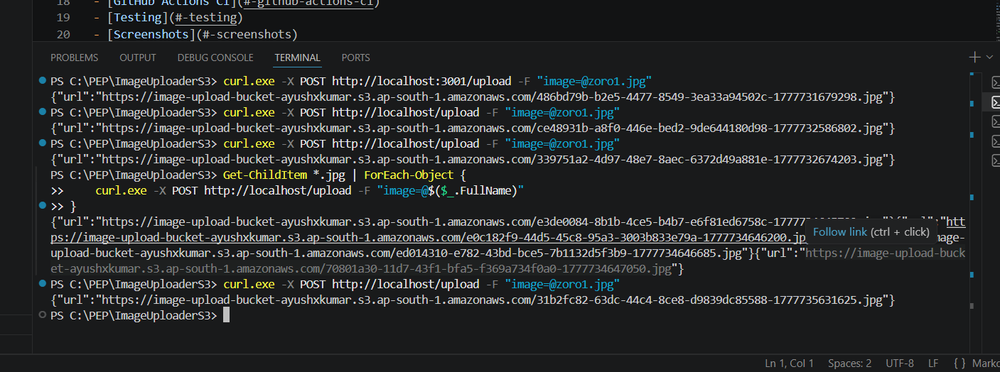
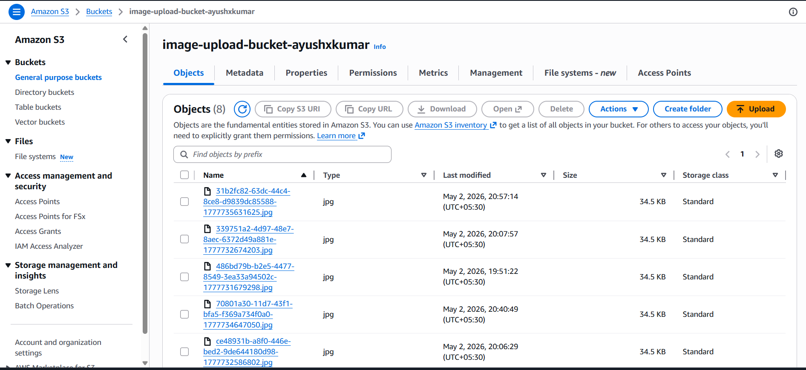
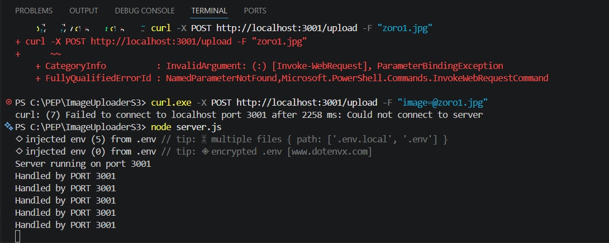
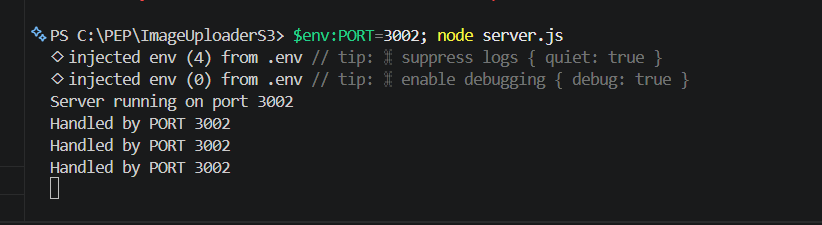
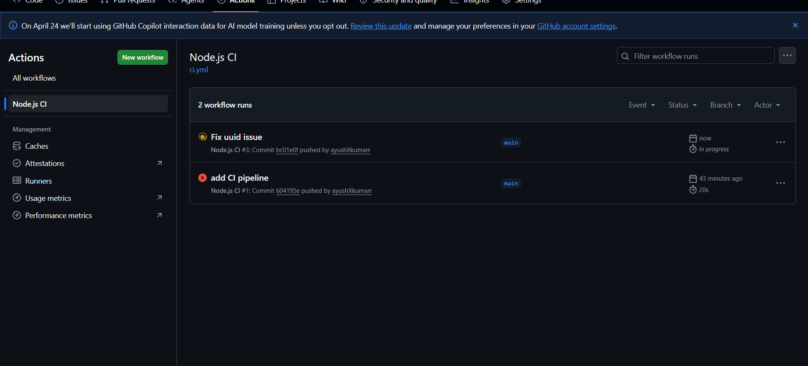

# 🖼️ Scalable Image Upload Server

> A production-style backend system that uploads images to AWS S3, load-balanced across multiple Node.js instances using NGINX — with a CI/CD pipeline via GitHub Actions.

---

## 📌 Table of Contents

- [Overview](#-overview)
- [Architecture](#-architecture)
- [Tech Stack](#-tech-stack)
- [Features](#-features)
- [Project Structure](#-project-structure)
- [Getting Started](#-getting-started)
- [Running Multiple Instances](#-running-multiple-instances)
- [NGINX Configuration](#-nginx-configuration)
- [API Reference](#-api-reference)
- [GitHub Actions CI](#-github-actions-ci)
- [Testing](#-testing)
- [Screenshots](#-screenshots)
- [Security Notes](#-security-notes)

---

## 🧠 Overview

This project demonstrates a **horizontally scalable** image upload backend — built without any database. Images are validated, resized, and stored directly on **AWS S3**, while **NGINX** distributes incoming traffic across multiple Node.js server instances using **round-robin load balancing**.

---

## 🏗️ Architecture

```
Client (curl / Postman)
        │
        ▼
  ┌─────────────┐
  │    NGINX    │  ← Load Balancer (port 80)
  │ Round Robin │
  └──────┬──────┘
         │
    ┌────┴─────┐
    │          │
    ▼          ▼
Server 1    Server 2
(:3001)     (:3002)
    │          │
    └────┬─────┘
         │
         ▼
     ┌───────┐
     │  AWS  │
     │  S3   │  ← Image Storage
     └───────┘
```

---

## 🛠️ Tech Stack

| Layer | Technology |
|---|---|
| Runtime | Node.js |
| Framework | Express.js |
| File Handling | Multer |
| Image Resizing | Sharp |
| Cloud Storage | AWS S3 (SDK v3) |
| Load Balancer | NGINX |
| CI Pipeline | GitHub Actions |
| Unique Naming | UUID + Timestamp |

---

## ✨ Features

- ✅ `POST /upload` endpoint accepting `multipart/form-data`
- ✅ File type validation — only JPG/PNG allowed
- ✅ Max file size limit of **2MB**
- ✅ Image resizing before upload (width: 300px)
- ✅ Unique filenames using UUID + timestamp
- ✅ Direct public S3 URL returned in response
- ✅ Round-robin load balancing across 2 server instances
- ✅ GitHub Actions pipeline on every push/PR
- ✅ No database required

---

## 📁 Project Structure

```
image-upload-server/
├── .github/
│   └── workflows/
│       └── ci.yml          # GitHub Actions CI pipeline
├── server.js               # Main Express server
├── s3.js                   # AWS S3 client config
├── .env                    # Environment variables (not committed)
├── .gitignore
├── package.json
└── README.md
```

---

## 🚀 Getting Started

### 1. Clone the repository

```bash
git clone https://github.com/ayushXkumarr/image-upload-server.git
cd image-upload-server
```

### 2. Install dependencies

```bash
npm install
```

### 3. Create your `.env` file

```env
PORT=3001
AWS_ACCESS_KEY_ID=your_access_key
AWS_SECRET_ACCESS_KEY=your_secret_key
AWS_REGION=eu-north-1
S3_BUCKET_NAME=your-bucket-name
```

> ⚠️ Never commit `.env` to version control.

### 4. Run the server

```bash
node server.js
```

You should see:
```
Server running on port 3001
```

---

## 🔁 Running Multiple Instances

Open two separate terminals and run:

**Terminal 1:**
```bash
node server.js
```

**Terminal 2 (Windows PowerShell):**
```powershell
$env:PORT=3002; node server.js
```

Both servers will now handle requests independently, and NGINX will distribute traffic between them.

---

## 🌐 NGINX Configuration

### Install NGINX

Download from [nginx.org](https://nginx.org/en/download.html) and extract to `C:\nginx\`.

### Edit `conf/nginx.conf`

```nginx
worker_processes  1;

events {
    worker_connections  1024;
}

http {
    include       mime.types;
    default_type  application/octet-stream;

    sendfile        on;
    keepalive_timeout  65;

    upstream backend {
        server 127.0.0.1:3001;
        server 127.0.0.1:3002;
    }

    server {
        listen 80;
        server_name localhost;

        location / {
            proxy_pass http://backend;
            proxy_set_header Host $host;
            proxy_set_header X-Real-IP $remote_addr;
        }
    }
}
```

### Start NGINX

```bash
cd C:\nginx\nginx-1.30.0
.\nginx.exe
```

### Verify load balancing

Send multiple requests and check terminal logs:
```
Handled by PORT 3001
Handled by PORT 3002
Handled by PORT 3001
```

---

## 📡 API Reference

### `POST /upload`

Upload an image file to AWS S3.

**Request**

| Field | Type | Description |
|---|---|---|
| `image` | File | JPG or PNG, max 2MB |

**Content-Type:** `multipart/form-data`

**Response (200 OK)**

```json
{
  "url": "https://your-bucket.s3.eu-north-1.amazonaws.com/uuid-timestamp.jpg"
}
```

**Error Responses**

| Status | Message |
|---|---|
| 400 | `No file uploaded` |
| 400 | `Only images allowed` |
| 413 | `File too large` |
| 500 | `Internal server error` |

---

## ⚙️ GitHub Actions CI

The CI pipeline runs automatically on every `push` and `pull_request` to `main`.

**File:** `.github/workflows/ci.yml`

```yaml
name: Node.js CI

on:
  push:
    branches: [ "main" ]
  pull_request:
    branches: [ "main" ]

jobs:
  build:
    runs-on: ubuntu-latest

    steps:
      - name: Checkout code
        uses: actions/checkout@v4

      - name: Setup Node.js
        uses: actions/setup-node@v4
        with:
          node-version: 18

      - name: Install dependencies
        run: npm install

      - name: Check if server runs
        run: |
          node server.js &
          sleep 5
          curl http://localhost:3001 || exit 1
```

**What it does:**
- Checks out the code
- Sets up Node.js 18
- Installs all dependencies
- Boots the server and verifies it responds
- **Fails the pipeline** if anything breaks

---

## 🧪 Testing

### Upload a single image

```bash
curl.exe -X POST http://localhost/upload -F "image=@test.jpg"
```

### Expected response

```json
{
  "url": "https://your-bucket.s3.eu-north-1.amazonaws.com/abc123-1234567890.jpg"
}
```

### Upload multiple images (PowerShell)

```powershell
Get-ChildItem *.jpg, *.png | ForEach-Object {
    curl.exe -X POST http://localhost/upload -F "image=@$($_.FullName)"
}
```

### Verify on S3

Open the returned URL in a browser — the image should load directly.

---

## 📸 Screenshots

### 1. API Upload — Successful Response
> Multiple `curl` requests sent to the server, each returning a unique public S3 URL confirming successful upload.



---

### 2. AWS S3 Bucket — Uploaded Images
> The S3 bucket `image-upload-bucket-ayushxkumar` showing **8 uploaded objects** with UUID-based filenames, timestamps, and sizes.



---

### 3. Image Accessible via Public S3 URL
> The uploaded Zoro image opened directly in the browser using the returned S3 URL — confirming public access is working correctly.


---

### 4. Server 1 — Running on Port 3001
> Terminal showing `Server running on port 3001` with multiple `Handled by PORT 3001` logs confirming requests are being received.



---

### 5. Server 2 — Running on Port 3002
> Terminal showing `Server running on port 3002` with `Handled by PORT 3002` logs — proving round-robin load balancing is distributing traffic across both instances.



---

### 6. GitHub Actions — CI Pipeline
> GitHub Actions tab showing the Node.js CI workflow with multiple runs triggered on push to `main`.



---

> 📁 All screenshots are stored in the `/screenshots` folder of this repository.

---

## 🔐 Security Notes

- **IAM user** with `AmazonS3FullAccess` is used instead of root credentials, following the principle of least privilege.
- AWS credentials are stored in `.env` and excluded from version control via `.gitignore`.
- In a production environment, **signed URLs** would be used instead of public bucket access to provide time-limited, secure access to uploaded files.

---

## 👨‍💻 Author

**Ayush Kumar**  
[GitHub](https://github.com/ayushXkumarr)
